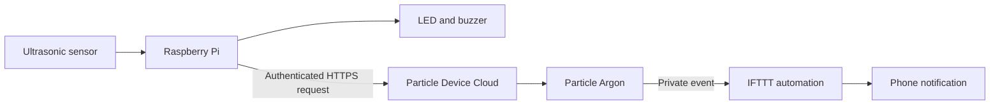

# SIT210 - Embedded Systems Development

An interview-ready portfolio of embedded systems and Internet of Things projects built with **Particle Argon/Photon**, **Raspberry Pi**, **C++**, and **Python**.

The repository demonstrates GPIO, digital and analogue sensors, PWM, I2C, desktop-to-hardware interfaces, Particle cloud functions, publish/subscribe events, webhooks, and multi-device system integration. It is based on individual coursework completed for Deakin University's SIT210 Embedded Systems Development unit in 2021 and has been reorganised so a technical interviewer can understand the work without knowing the original assessment structure.

> **Start here:** the strongest project is [Arm and Alarm](projects/06-arm-and-alarm/), an end-to-end proximity alert connecting a Raspberry Pi, Particle Argon, Particle Device Cloud, and an IFTTT notification workflow.

## Featured System: Arm and Alarm



The Raspberry Pi measures an ultrasonic echo pulse and converts it to distance. After several consecutive readings cross the configured threshold, it activates local feedback and calls a Particle cloud function. The Particle device acknowledges the request using a non-blocking LED pattern and publishes a private event for the notification workflow.

This project provides a clear interview discussion around sensor timing, system boundaries, cloud dependencies, credentials, error handling, blocking versus non-blocking firmware, false triggers, and possible production improvements.

## Project Index

| Project | Core idea | Main technologies |
|---|---|---|
| [01 - Particle Morse Code](projects/01-particle-morse-code/) | Encode text and signal it through an onboard LED | Particle Device OS, C++ |
| [02 - Particle Cloud Telemetry](projects/02-particle-cloud-telemetry/) | Publish sensor data and trigger cloud automations | DHT11, photoresistor, webhooks, IFTTT |
| [03 - Particle Cloud Control](projects/03-particle-cloud-control/) | Compare cloud functions with publish/subscribe events | Particle Cloud, C++ |
| [04 - Raspberry Pi GPIO GUIs](projects/04-raspberry-pi-gpio-gui/) | Control physical outputs from Tkinter interfaces | Python, Tkinter, gpiozero |
| [05 - Raspberry Pi Sensors](projects/05-raspberry-pi-sensors/) | Read ultrasonic and I2C sensors and produce PWM feedback | RPi.GPIO, BH1750, I2C, PWM |
| [06 - Arm and Alarm](projects/06-arm-and-alarm/) | Integrate sensing, local feedback, cloud control, and notification | Raspberry Pi, Particle Argon, HTTP, IFTTT |

## Repository Structure

```text
.
├── projects/
│   ├── README.md
│   ├── 01-particle-morse-code/
│   ├── 02-particle-cloud-telemetry/
│   ├── 03-particle-cloud-control/
│   ├── 04-raspberry-pi-gpio-gui/
│   ├── 05-raspberry-pi-sensors/
│   ├── 06-arm-and-alarm/
│   └── common/
├── requirements-rpi.txt
├── LICENSE
└── README.md
```

Every meaningful folder contains its own `README.md`, so GitHub automatically presents an explanation when the folder is opened.

## Running the Code

Most examples require physical hardware and cannot be fully exercised on a normal laptop. Each project README documents its hardware assumptions and run procedure.

For the Raspberry Pi examples:

```bash
python3 -m venv .venv
source .venv/bin/activate
pip install -r requirements-rpi.txt
```

For Particle firmware, open the relevant `.ino` file in Particle Workbench or the Particle Web IDE, select the correct target device, build, and flash it.

## Security and Configuration

Credentials are not stored in the repository. The Arm and Alarm Raspberry Pi client uses environment variables from a local `.env` file. Copy the supplied `.env.example`, insert current credentials locally, and never commit the populated file.

A Particle token found in the historical coursework archive was removed. Any token previously committed publicly should be revoked or rotated.

## Validation Status

The original projects were demonstrated on physical hardware during the 2021 unit. The portfolio version has been reorganised and lightly modernised:

- Python 2-style code was updated to Python 3.
- credentials and device identifiers were removed;
- repeated logic was placed into named functions;
- ultrasonic echo waits received timeouts;
- the featured alarm received consecutive-reading and cooldown controls;
- the Particle alarm pattern was changed to a non-blocking state machine;

The modernised code has **not** been fully revalidated on the original hardware or current cloud accounts. This distinction is documented rather than hidden.

## Academic Context and Authorship

The projects originated as individual SIT210 coursework completed at Deakin University. University task sheets, grading documents, account screenshots, and duplicated reports are not included because they distract from the implementation. The repository preserves the technical work while presenting it by engineering concept rather than assessment number.

## Licence

Released under the [MIT Licence](LICENSE).
