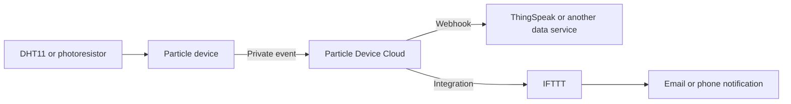

# Particle Cloud Telemetry

Two Particle firmware examples that move physical sensor readings into cloud workflows.

## What It Demonstrates

- digital temperature sensing with a DHT11;
- analogue light sensing with a photoresistor;
- private Particle event publication;
- webhook-based telemetry routing;
- state-change events for notification automation;
- calibration and cloud-dependency trade-offs.

## Architecture

## Included Examples

### Temperature Webhook

The DHT11 is sampled at a fixed interval. Valid temperature readings are published as a private `temperature_c` event. A Particle webhook can forward the event value to a storage or visualisation service such as ThingSpeak.

### Light Exposure Notification

A photoresistor provides an analogue value. The firmware compares it with a configured threshold, updates the onboard LED, and publishes only when the bright/dark state changes. Publishing on state change avoids sending the same event on every loop.

## Files

| Path | Purpose |
|---|---|
| [`src/dht_temperature_webhook.ino`](src/dht_temperature_webhook.ino) | DHT11 temperature event publisher |
| [`src/light_exposure_ifttt.ino`](src/light_exposure_ifttt.ino) | Photoresistor state-change publisher |
| [`src/README.md`](src/README.md) | Source-specific build and configuration notes |

## Build and Run

Open one firmware file at a time in Particle Workbench or the Particle Web IDE. Install the DHT library for the temperature example, select the target device, build, and flash.

Cloud webhooks and IFTTT applets must be configured separately in the associated services. Credentials are intentionally not stored in this repository.

## Engineering Discussion

- Thresholds must be calibrated for the actual resistor network and environment.
- Hysteresis would reduce rapid toggling when a reading sits near the threshold.
- DHT11 sensors are inexpensive but comparatively slow and low precision.
- Cloud telemetry depends on network availability and external service uptime.
- Event frequency should be designed around rate limits and useful data resolution.

## Interview Explanation

> These examples show how I connected physical sensor data to cloud services. The important design point was not just reading the sensor—it was deciding when to publish, validating readings, and recognising that calibration, network outages, and external service limits affect the full system.

## Historical Demonstration

- Light exposure and IFTTT: https://www.youtube.com/watch?v=P-1-nuCCccI
