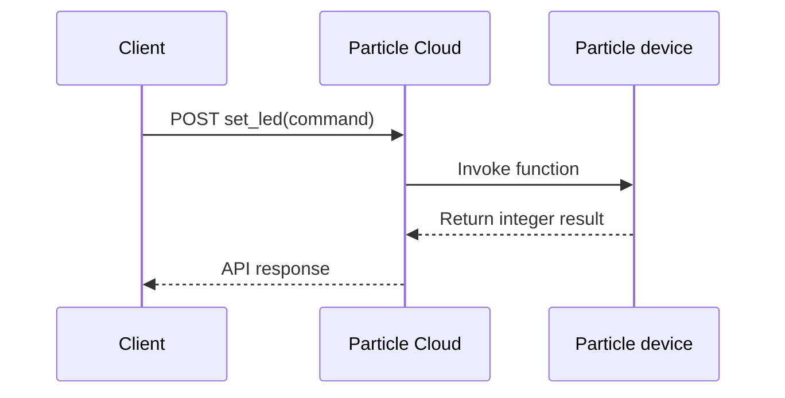

# Particle Cloud Control and Device Events

Two Particle firmware examples comparing synchronous remote control with asynchronous publish/subscribe messaging.

## What It Demonstrates

- exposing a device function through `Particle.function()`;
- validating remote command arguments;
- subscribing to private Particle events;
- mapping received events to physical output patterns;
- understanding coupling, response behaviour, and blocking callbacks;
- keeping access tokens out of browser-side code.

## Interaction Patterns

### Cloud Function

The LED controller registers a function named `set_led`. A trusted client can call it with `red`, `yellow`, `green`, or `off`. The handler returns `1` for a valid command and `-1` for an unsupported value.

### Publish/Subscribe

The buddy-events firmware subscribes to a named event and maps `wave` and `pat` payloads to different LED patterns. Publishers and subscribers do not need a direct request/response relationship.

## Files

| Path | Purpose |
|---|---|
| [`src/cloud_led_controller.ino`](src/cloud_led_controller.ino) | Remote red/yellow/green LED control through a cloud function |
| [`src/buddy_events.ino`](src/buddy_events.ino) | Event subscriber with two LED response patterns |
| [`src/README.md`](src/README.md) | Source-specific configuration and limitations |

## Security Note

Do not place a Particle access token in HTML or public JavaScript. A browser page is visible to the user and anyone who can inspect its source. A safer design uses a trusted backend, limited-scope credentials, and authenticated users.

## Engineering Discussion

A cloud function is useful when the caller needs a direct result. Publish/subscribe is more loosely coupled and useful for distributing events. Both designs need short, predictable callbacks. Long `delay()` calls inside a cloud handler or subscriber can make the firmware unresponsive.

The buddy example preserves blocking patterns from the original exercise for clarity. A production version would use a non-blocking state machine similar to the featured Arm and Alarm firmware.

## Interview Explanation

> This project helped me distinguish direct remote procedure-style control from event-driven communication. I can explain when each model is useful, why callbacks should return quickly, and why credentials must never be embedded in a public web page.

## Historical Demonstrations

- Buddy events: https://www.youtube.com/watch?v=TZFllEHy9OI
- Cloud-controlled LEDs: https://www.youtube.com/watch?v=2U2ouQ-gZK0
