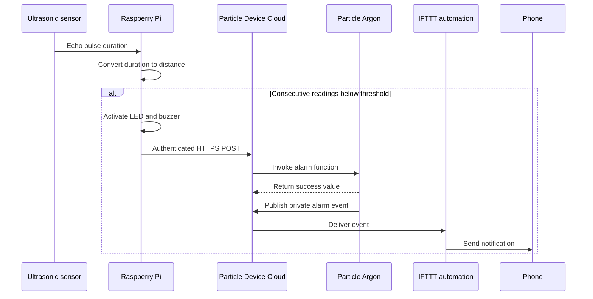

# Arm and Alarm

A multi-device embedded and IoT prototype that detects a nearby object, provides a local alarm, calls a Particle cloud function, and publishes a private event that can trigger a phone notification.

This is the featured project in the repository because it joins hardware, Python, firmware, an authenticated API, cloud events, and third-party automation into one explainable system.

## System Objective

The project explores a portable entry-alert concept for a home environment. It is a learning prototype, not a certified security or life-safety product.

## Architecture

## Hardware

- Raspberry Pi;
- Particle Argon;
- HC-SR04-style ultrasonic sensor;
- buzzer;
- red status LED;
- breadboard and jumper wires;
- internet connection for the remote notification path.

## Source Layout

| Path | Purpose |
|---|---|
| [`particle/alarm_receiver.ino`](particle/alarm_receiver.ino) | Particle cloud function, non-blocking acknowledgement pattern, and event publisher |
| [`particle/README.md`](particle/README.md) | Firmware build and behaviour notes |
| [`raspberry_pi/proximity_alarm.py`](raspberry_pi/proximity_alarm.py) | Sensor loop, local alarm, configuration, and cloud API client |
| [`raspberry_pi/.env.example`](raspberry_pi/.env.example) | Safe configuration template |
| [`raspberry_pi/README.md`](raspberry_pi/README.md) | Wiring, configuration, and run instructions |

## Trigger Behaviour

1. The Raspberry Pi sends a short pulse to the ultrasonic trigger pin.
2. It measures the echo pulse duration and converts it to distance.
3. It requires multiple consecutive readings inside the configured threshold.
4. It activates a local LED and buzzer.
5. It calls the Particle function with an authenticated HTTPS request.
6. The Particle device publishes a private `alarm/triggered` event.
7. A cooldown prevents immediate notification flooding.

## Security

The original historical material contained a Particle access token in source and browser-side HTML. The portfolio version removes it and loads credentials from a local `.env` file.

Any token previously uploaded to a public repository should be revoked or rotated. Browser-delivered code must never contain a long-lived account token.

## Reliability Improvements in This Version

- timeouts on both ultrasonic echo transitions;
- multiple consecutive readings before triggering;
- a notification cooldown;
- HTTP request timeout and response validation;
- GPIO cleanup on exit;
- non-blocking Particle LED acknowledgement;
- private Particle event publication;
- configuration separated from source code.

## Known Limitations

- The remote path depends on Wi-Fi, Particle Cloud, and IFTTT availability.
- The sensor measures proximity; it does not identify a person or classify motion.
- There is no persistent arm/disarm state or authenticated control interface.
- A failed notification is logged but not stored for later delivery.
- Sensor filtering remains basic and needs calibration in the actual environment.
- The modernised version has not been re-tested on the original hardware in 2026.

## Improvements I Would Make Now

- model the system with explicit `disarmed`, `armed`, `triggered`, and `cooldown` states;
- use median filtering or sensor fusion with a PIR sensor;
- preserve useful local behaviour during cloud outages;
- add bounded retry with exponential back-off and idempotent events;
- add structured logs and health metrics;
- use secure device provisioning and limited-scope credentials;
- design an enclosure, power plan, and repeatable hardware test procedure.

## Interview Explanation

> Arm and Alarm links an ultrasonic sensor on a Raspberry Pi to a Particle Argon through the Particle cloud API. The Pi performs measurement and local feedback, while the Particle device publishes a private event for a phone-notification workflow. The strongest lessons were managing system boundaries, preventing false triggers and repeated alerts, avoiding blocking firmware, and treating credentials and cloud outages as part of the design rather than afterthoughts.

## Historical Demonstration

- https://youtu.be/-HZN0-ULUgg
